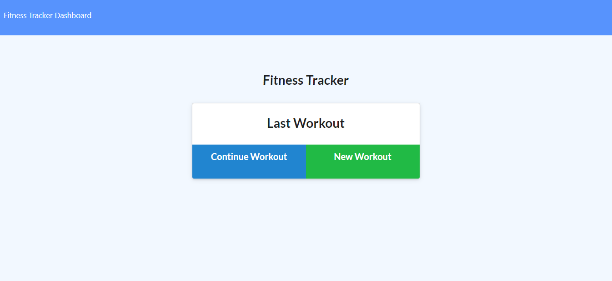

# Workout_Tracker

The objective of this project was to create a daily workout tracker with the ability to log multiple exercises for a workout on a given day, while also including the exercise details, such as: name, type, weight, sets, reps, distance, and duration.  In order to achieve this goal, mongoose and express were used on the back-end to create a database and handle routes, respectively.  A link to the working application can be found below.

https://fast-crag-16947.herokuapp.com/
